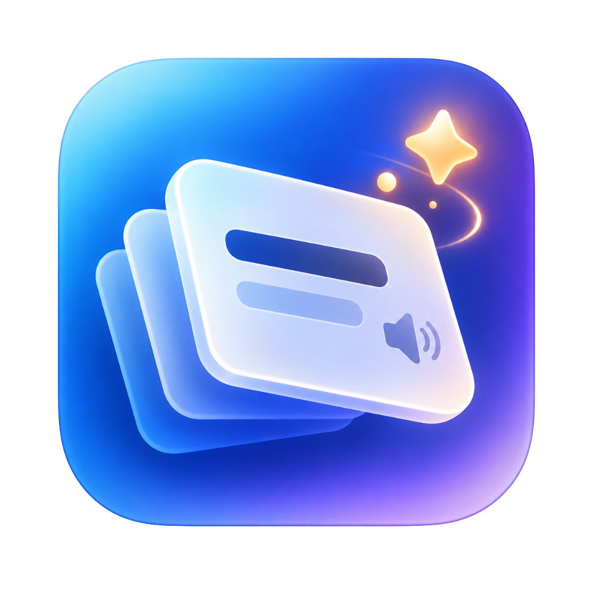

# WordMote

   
  <b>Minimalist Menu Bar & Smart Spaced Repetition Vocabulary App for macOS</b> 
  <i>Master English vocabulary effortlessly through Menu Bar ambient learning and smart active recall.</i>

  
  
  
  
  

  

---

### 🌐 Language Selector / Chọn ngôn ngữ / 选择语言 / 言語を選択 / เลือกภาษา

  <b><a href="#-english">🇬🇧 English</a></b> •
  <b><a href="#-tiếng-việt">🇻🇳 Tiếng Việt</a></b> •
  <b><a href="#-简体中文">🇨🇳 简体中文</a></b> •
  <b><a href="#-日本語">🇯🇵 日本語</a></b> •
  <b><a href="#-ภาษาไทย">🇹🇭 ภาษาไทย</a></b>

---

## 🇬🇧 English

### Overview
**WordMote** is a lightweight, distraction-free macOS menu bar application designed for effortless vocabulary acquisition. Rather than forcing you into cumbersome flashcard sessions, WordMote quietly rotates high-yield vocabulary directly in your macOS Status Bar, applies an adaptive Spaced Repetition System (SRS), and challenges you with periodic active recall quizzes that respect your deep work focus.

---

### 📸 Visual User Guide & Key Features

#### 1. Ambient Menu Bar Learning
WordMote lives seamlessly inside your top macOS Menu Bar. As you browse, code, or work, vocabulary words cycle in the background at your preferred pace.

  

- **Unobtrusive Presence**: Shows the brain icon and the active word without cluttering your desktop.
- **Cheat-Proof Design**: When a quiz pop-up triggers, the menu bar title automatically hides the answer and only reappears once the test is completed.
- **Interactive Dropdown**: Click the menu item anytime to add new words, review your vocabulary collection, or test yourself immediately.

---

#### 2. Active Recall Pop-up Quizzes (50/50 Dual Modes)
Passive exposure is paired with active retrieval practice. WordMote periodically prompts you with bite-sized challenges to reinforce your long-term memory.

<table align="center" border="0" cellpadding="10" cellspacing="0">
  <tr>
    <td align="center" width="50%">
      <b>Mode A: Multiple Choice Quiz</b>  
      
      

        • Pick the correct meaning from 4 shuffled options. 
        • <b>Native US Audio</b>: Tap the speaker icon to hear authentic pronunciation via Apple Speech Synthesis. 
        • Contextual mnemonic visuals help anchor mental connections.
      

    </td>
    <td align="center" width="50%">
      <b>Mode B: Active Typing Recall</b>  
      
      

        • Challenge deep memory retrieval by typing the exact English word based on its definition. 
        • Case-insensitive validation with gentle shake animation on errors. 
        • Flexible <b>Snooze 30 mins</b> & <b>Snooze 1 hour</b> buttons when you need uninterrupted focus.
      

    </td>
  </tr>
</table>

---

#### 3. Custom Preferences & 1-Click Auto-Update
Tailor your learning rhythm and keep your app continuously up to date without manual maintenance.

  

- **Word Rotation Interval**: Adjust how often the Menu Bar switches to a new vocabulary word (in minutes).
- **Memory System**: Configure base repetition intervals for words needing review.
- **Quiz Popup Interval**: Set how frequently active recall quizzes appear.
- **1-Click In-App Auto-Update**: When a new version is released, simply click **Update Now**. WordMote downloads the package silently, upgrades itself in `/Applications`, and relaunches smoothly.

---

### 🧠 The Science: Adaptive Spaced Repetition (SRS)
WordMote uses a progressive interval expansion model based on your consecutive correct recall streak:

| Correct Streak | Review Interval | Learning Stage |
| :---: | :---: | :--- |
| **1 - 2 times** | **1 Day** | Initial Acquisition |
| **3 - 4 times** | **3 Days** | Early Retention |
| **5 times** | **5 Days** | Intermediate Consolidation |
| **6+ times** | **+5 Days per streak** $(Days = (Streak - 4) \times 5)$ | Long-Term Mastery |

> [!NOTE]
> Mastered words are never forgotten or deleted. The system dynamically brings them back when retention decay is mathematically due.

---

### 🛡️ Smart Fullscreen Do-Not-Disturb
WordMote automatically inspects macOS display layers (`CGWindowListCopyWindowInfo`):
- When you are watching **YouTube**, **Netflix**, giving **keynote presentations**, or playing games in **full screen**, quizzes are **silently postponed by 10 minutes**.
- Zero interruptions during your entertainment or meetings.

---

### 📥 Download & Installation

1. Download the latest release: **[WordMote.dmg](https://github.com/kevinduong0101/WordMote/releases/latest/download/WordMote.dmg)**
2. Open `WordMote.dmg` and drag `WordMote.app` into your **Applications** folder.
3. Launch **WordMote** from Applications.
4. *macOS Gatekeeper tip*: If macOS shows a prompt regarding an unidentified developer:
   - Right-click `WordMote.app` > choose **Open**, or
   - Go to **System Settings** > **Privacy & Security** > click **Open Anyway**.

---

## 🇻🇳 Tiếng Việt

### Giới thiệu
**WordMote** là ứng dụng học từ vựng tiếng Anh tối giản, chạy 100% trên thanh Menu Bar của macOS. Ứng dụng giúp bạn hấp thu từ vựng tự nhiên trong suốt ngày làm việc: từ vựng tự động luân phiên hiển thị trước mắt, kết hợp thuật toán lặp lại ngắt quãng (Spaced Repetition System - SRS) và bài tập trắc nghiệm thông minh không làm gián đoạn công việc.

---

### 📸 Hướng Dẫn Sử Dụng Trực Quan & Tính Năng Chính

#### 1. Học Ngầm Tự Nhiên Trên Menu Bar
WordMote xuất hiện gọn gàng ngay trên thanh trạng thái macOS. Trong lúc bạn làm việc, lướt web hay gõ code, từ vựng sẽ tự động đổi theo chu kỳ bạn cài đặt.

  

- **Không chiếm diện tích**: Nằm gọn trên thanh Menu Bar với biểu tượng não bộ `🧠` kèm từ vựng tiếng Anh.
- **Tự động ẩn khi làm bài Quiz**: Mỗi khi popup Quiz hiện ra, chữ trên Menu Bar sẽ lập tức ẩn đi để bạn không thể "nhìn lén" đáp án, và sẽ tự động hiện lại từ kế tiếp ngay sau khi trả lời xong.
- **Menu tương tác**: Bấm chuột vào biểu tượng để thêm từ mới, quản lý bộ từ vựng hoặc kích hoạt bài kiểm tra ngay lập tức.

---

#### 2. Bài Tập Kiểm Tra Chủ Động (2 Chế Độ Ngẫu Nhiên 50/50)
Kết hợp giữa việc nhìn từ thụ động và truy xuất chủ động (Active Recall) để khắc sâu từ vựng vào trí nhớ dài hạn.

<table align="center" border="0" cellpadding="10" cellspacing="0">
  <tr>
    <td align="center" width="50%">
      <b>Chế độ A: Trắc Nghiệm 4 Lựa Chọn</b>  
      
      

        • Chọn định nghĩa đúng trong 4 đáp án xáo trộn. 
        • <b>Phát âm giọng Mỹ bản ngữ</b>: Bấm vào biểu tượng loa để nghe đọc chuẩn qua công nghệ Apple Speech Synthesis. 
        • Hình ảnh trực quan sinh động giúp liên tưởng và ghi nhớ nhanh.
      

    </td>
    <td align="center" width="50%">
      <b>Chế độ B: Gõ Lại Từ Vựng (Active Typing)</b>  
      
      

        • Rèn luyện trí nhớ sâu bằng cách tự tay gõ lại chính xác từ tiếng Anh dựa theo nghĩa và hình ảnh. 
        • Không phân biệt hoa/thường, hiệu ứng rung báo lỗi trực quan khi gõ sai. 
        • Có nút <b>Hoãn 30 phút (Snooze 30 mins)</b> và <b>Hoãn 1 giờ</b> khi bạn đang bận việc gấp.
      

    </td>
  </tr>
</table>

---

#### 3. Bảng Cài Đặt Cá Nhân & Tự Động Nâng Cấp 1-Click
Tùy biến nhịp điệu học tập và nâng cấp ứng dụng hoàn toàn tự động, người dùng không cần phải tải lại hay thao tác kéo thả thủ công.

  

- **Word Rotation Interval**: Số phút tự động đổi sang từ vựng tiếp theo trên Menu Bar.
- **Memory System**: Khoảng thời gian cơ bản để ôn lại các từ chưa thuộc.
- **Quiz Popup Interval**: Tần suất xuất hiện bài trắc nghiệm pop-up.
- **Tự động cập nhật 1-Click (Software Update)**: Khi có bản mới trên GitHub, chỉ cần bấm **Update Now**, app sẽ tự tải ngầm file DMG, tự cập nhật vào `/Applications` và tự khởi động lại phiên bản mới.

---

### 🧠 Thuật Toán Ghi Nhớ Ngắt Quãng (SRS)
Khoảng cách ôn tập được tự động giãn cách dựa trên số lần bạn trả lời đúng liên tiếp:

| Chuỗi đúng liên tiếp | Thời gian ôn lại | Giai đoạn ghi nhớ |
| :---: | :---: | :--- |
| **1 - 2 lần** | **Sau 1 ngày** | Tiếp nhận từ mới |
| **3 - 4 lần** | **Sau 3 ngày** | Ghi nhớ ban đầu |
| **5 lần** | **Sau 5 ngày** | Củng cố trí nhớ |
| **6 lần trở lên** | **+5 ngày mỗi chuỗi** (10 ngày, 15 ngày, 20 ngày...) | Khắc sâu vào trí nhớ dài hạn |

---

### 🛡️ Chế Độ Thông Minh: Không Làm Phiền Khi Xem Phim
Hệ thống tự động phát hiện cửa sổ toàn màn hình qua macOS CoreGraphics:
- Khi bạn xem **YouTube**, **Netflix**, thuyết trình slide hoặc chơi game toàn màn hình, WordMote sẽ **tự động hoãn câu hỏi 10 phút một cách yên lặng**.
- Không bao giờ làm gián đoạn trải nghiệm giải trí hoặc công việc quan trọng.

---

### 📥 Tải Về & Cài Đặt

1. Tải bản mới nhất: **[WordMote.dmg](https://github.com/kevinduong0101/WordMote/releases/latest/download/WordMote.dmg)**
2. Mở file `WordMote.dmg` và kéo icon `WordMote.app` vào thư mục **Applications**.
3. Chạy **WordMote** từ Applications.
4. *Khắc phục thông báo nhà phát triển macOS*: Nếu macOS báo chưa xác minh nhà phát triển:
   - Chuột phải vào `WordMote.app` > chọn **Open**, hoặc
   - Vào **System Settings** > **Privacy & Security** > bấm **Open Anyway**.

---

## 🇨🇳 简体中文

### 概述
**WordMote** 是一款专为 macOS 设计的极简菜单栏英语词汇学习工具。无需繁重的背单词打卡任务，WordMote 将重点词汇实时融入您的顶部菜单栏，借助科学的间隔重复记忆系统（SRS）与智能主动召回弹窗，让您在日常办公中自然掌握大量词汇。

### ✨ 核心功能
1. **菜单栏沉浸式记忆助手**：常驻 macOS 顶部状态栏，实时轮播当前词汇；弹出测验时自动隐藏菜单栏词条，防止偷看。
2. **主动召回双模式测验（50/50）**：支持四选一客观题与拼写填空题，配备原生美音朗读（TTS）与快捷延后（Snooze 30m / 1h）。
3. **自适应间隔重复记忆算法（SRS）**：根据连续召回正确率智能递增复习周期（1天、3天、5天、10天、15天...）。
4. **全屏智能防打扰**：全屏观看 Netflix、YouTube 或演示幻灯片时，测验弹窗自动静默顺延 10 分钟。
5. **应用内一键自动升级**：内置更新管理器，点击即可全自动下载、静默替换安装并无缝重启。

---

## 🇯🇵 日本語

### 概要
**WordMote** は、macOS のメニューバーに常駐するスマートな英単語学習アプリケーションです。普段のPC作業を妨げることなく、メニューバー上で単語を自然に確認でき、忘却曲線に合わせた分散学習（SRS）とポップアップ確認テストによって確実な記憶定着を促します。

### ✨ 主な特長
1. **メニューバー統合型学習コンパニオン**：メニューバー上で単語が自動ローテーション。テスト出題時はメニューバーの単語が非表示になり、カンニングを防ぎます。
2. **能動的想起ポップアップテスト**：4択問題とスペリング入力問題の2つの出題形式、ネイティブ音声読み上げ（TTS）、スヌーズ（30分/1時間）を完備。
3. **適応型分散学習システム（SRS）**：連続正解数に応じて復習間隔を自動調整（1日後、3日後、5日後、10日後…）。
4. **全画面メディア自動検知・非通知機能**：フルスクリーン動画視聴中やプレゼン中は、出題を自動的に10分間延期。
5. **ワンクリック自動アップデート**：アプリ内から1クリックでダウンロード・置換・再起動まで全自動で完了。

---

## 🇹🇭 ภาษาไทย

### ภาพรวม
**WordMote** คือแอปพลิเคชันสำหรับ macOS ที่ออกแบบมาเพื่อการเรียนรู้คำศัพท์ภาษาอังกฤษผ่าน Menu Bar อย่างเรียบง่าย คำศัพท์จะแสดงหมุนเวียนบนแถบสถานะด้านบน พร้อมระบบจำคำศัพท์เว้นระยะ (SRS) และควิซสุ่มทดสอบความจำที่ไม่รบกวนเวลาทำงาน

### ✨ ฟีเจอร์เด่น
1. **แถบ Menu Bar มินิมอลเรียบหรู**: แสดงคำศัพท์ปัจจุบันแบบเรียลไทม์ และซ่อนคำศัพท์อัตโนมัติขณะทำควิซเพื่อป้องกันการดูเฉลย
2. **ควิซทดสอบความจำ 2 โหมด**: มีทั้งแบบเลือกตอบ 4 ตัวเลือกและแบบพิมพ์สะกดคำศัพท์ พร้อมเสียงอ่านสำเนียงอเมริกันและปุ่มเลื่อนเวลา (Snooze 30m / 1h)
3. **ระบบการจำคำศัพท์แบบเว้นระยะ (SRS)**: คำนวณช่วงเวลาทบทวนตามความแม่นยำอัตโนมัติ (1 วัน, 3 วัน, 5 วัน, 10 วัน...)
4. **โหมดตรวจจับภาพยนตร์เต็มหน้าจอ (Do-Not-Disturb)**: เลื่อนเวลาควิซ 10 นาทีอัตโนมัติเมื่อดูวิดีโอหรือนำเสนองานเต็มจอ
5. **อัปเดตอัตโนมัติในคลิกเดียว**: ดาวน์โหลดและติดตั้งเวอร์ชันใหม่อัตโนมัติโดยไม่ต้องลากไฟล์เอง

---

## 📄 License
This project is licensed under the MIT License - see the [LICENSE](LICENSE) file for details.
